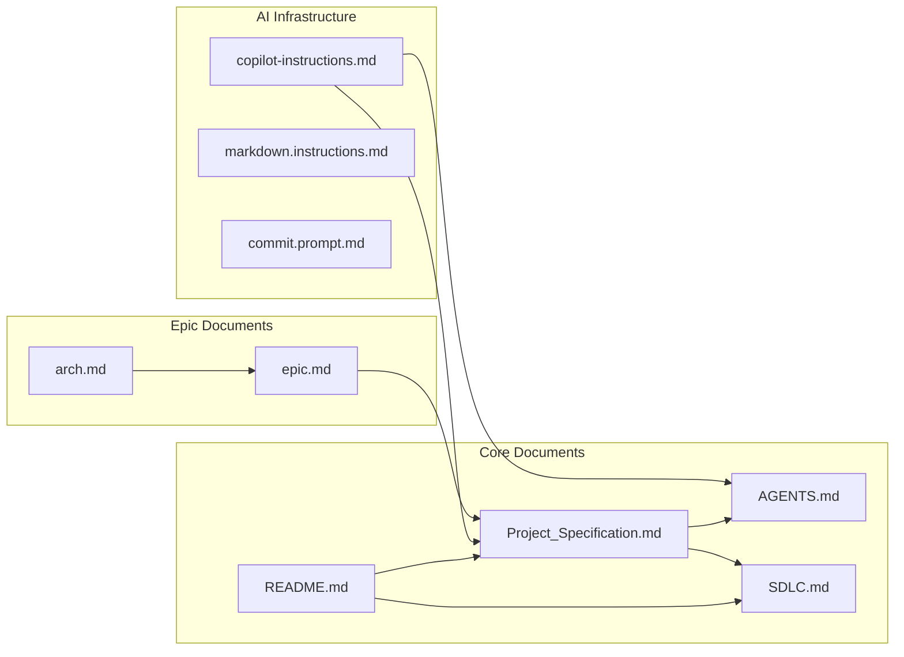

## 1. Epic Architecture Overview

Phase 1 establishes the **documentation foundation** for the Academic Journey Portfolio (AJP) system. Unlike traditional development epics, this phase focuses on creating the specification artifacts, development standards, and AI-assisted development infrastructure that will guide all subsequent implementation phases.

**Technical Approach**: Create a structured documentation system within the repository that serves as the single source of truth for architecture decisions, requirement definitions, and development processes. The documentation architecture follows a hierarchical, cross-referenced structure optimized for both human and AI consumption (GitHub Copilot custom instructions).

**Key Technical Decisions**:

- **Documentation-as-Code**: All specifications stored as version-controlled Markdown with YAML front matter
- **AI-First Documentation**: Custom instructions and prompt templates enable consistent AI-assisted development
- **Modular Structure**: Documents organized by phase and domain for targeted reference
- **Validation-Ready**: Front matter schemas designed for automated validation in future phases

---

## 2. System Architecture Diagram

```mermaid
flowchart TB
    subgraph UserLayer["👤 User Layer"]
        DEV["Portfolio Owner<br/>(Developer)"]
        AI["GitHub Copilot<br/>(AI Assistant)"]
        FUTURE["Future Maintainer"]
    end

    subgraph DocumentationLayer["📚 Documentation Layer"]
        subgraph CoreDocs["Core Specifications"]
            SPEC["Project_Specification.md<br/>(Source of Truth)"]
            AGENTS["AGENTS.md<br/>(Quick Reference)"]
            SDLC["SDLC.md<br/>(Phase Tracking)"]
        end
        
        subgraph AIInfra["AI Development Infrastructure"]
            COPILOT[".github/copilot-instructions.md"]
            PROMPTS[".github/prompt/*.md<br/>(Prompt Templates)"]
            INSTRUCTIONS[".github/instructions/*.md<br/>(Context Files)"]
        end
        
        subgraph EpicDocs["Epic Documentation"]
            EPIC["docs/phase-1-documentation/<br/>epic.md"]
            ARCH["docs/phase-1-documentation/<br/>arch.md"]
        end
    end

    subgraph ValidationLayer["✅ Validation Layer"]
        FRONTMATTER["Front Matter Schema<br/>Validation"]
        LINKS["Internal Link<br/>Verification"]
        STANDARDS["Markdown Standards<br/>Compliance"]
    end

    subgraph StorageLayer["💾 Storage Layer"]
        GIT["Git Repository<br/>(Version Control)"]
        GITHUB["GitHub<br/>(Remote Hosting)"]
    end

    subgraph FutureIntegration["🔮 Future Phase Integration"]
        PHASE2["Phase 2: Project Structure"]
        PHASE3["Phase 3: Content Pipeline"]
        PHASE4["Phase 4: Components"]
        PHASE5["Phase 5: Deployment"]
    end

    %% User interactions
    DEV -->|"Reads/Updates"| CoreDocs
    DEV -->|"Uses"| AIInfra
    AI -->|"Reads Context"| COPILOT
    AI -->|"Uses Templates"| PROMPTS
    AI -->|"Follows Standards"| INSTRUCTIONS
    FUTURE -->|"References"| SPEC
    FUTURE -->|"Quick Lookup"| AGENTS

    %% Document relationships
    SPEC -->|"Synced To"| AGENTS
    SPEC -->|"Defines Phases"| SDLC
    EPIC -->|"Implements"| ARCH
    COPILOT -->|"References"| SPEC
    COPILOT -->|"References"| AGENTS

    %% Validation
    CoreDocs -->|"Validated By"| FRONTMATTER
    EpicDocs -->|"Validated By"| FRONTMATTER
    CoreDocs -->|"Checked By"| LINKS
    AIInfra -->|"Checked By"| STANDARDS

    %% Storage
    DocumentationLayer -->|"Committed To"| GIT
    GIT -->|"Pushed To"| GITHUB

    %% Future phases consume documentation
    CoreDocs -.->|"Guides"| PHASE2
    CoreDocs -.->|"Guides"| PHASE3
    CoreDocs -.->|"Guides"| PHASE4
    CoreDocs -.->|"Guides"| PHASE5

    %% Styling
    classDef user fill:#e1f5fe,stroke:#01579b
    classDef docs fill:#fff3e0,stroke:#e65100
    classDef ai fill:#f3e5f5,stroke:#7b1fa2
    classDef validation fill:#e8f5e9,stroke:#2e7d32
    classDef storage fill:#fce4ec,stroke:#c2185b
    classDef future fill:#eceff1,stroke:#546e7a,stroke-dasharray: 5 5

    class DEV,FUTURE user
    class AI ai
    class SPEC,AGENTS,SDLC,EPIC,ARCH docs
    class COPILOT,PROMPTS,INSTRUCTIONS ai
    class FRONTMATTER,LINKS,STANDARDS validation
    class GIT,GITHUB storage
    class PHASE2,PHASE3,PHASE4,PHASE5 future
```

### Architecture Component Description

| Layer | Components | Purpose |
|-------|------------|---------|
| **User Layer** | Portfolio Owner, GitHub Copilot, Future Maintainer | Consumers of documentation artifacts |
| **Documentation Layer** | Core Specs, AI Infrastructure, Epic Docs | Structured knowledge base for project |
| **Validation Layer** | Front Matter, Links, Standards | Quality assurance for documentation |
| **Storage Layer** | Git, GitHub | Version control and collaboration |
| **Future Integration** | Phases 2-5 | Downstream consumers of Phase 1 output |

---

## 3. High-Level Features & Technical Enablers

### High-Level Features

| Feature | Description | Related Requirements |
|---------|-------------|---------------------|
| **F1: Hierarchical Documentation Structure** | Organized `docs/` folder with phase-based subdirectories | FR-001, FR-002 |
| **F2: Requirement Traceability** | Unique identifiers (REQ-XXX, SEC-XXX, etc.) with cross-references | FR-006 through FR-011 |
| **F3: AI Development Context** | Custom instructions and prompt templates for Copilot | FR-015 through FR-018 |
| **F4: Quick Reference System** | AGENTS.md provides <30-second requirement lookups | FR-012, FR-013, NFR-009 |
| **F5: Front Matter Schema** | Standardized YAML metadata for all documents | FR-003, NFR-002 |
| **F6: SDLC Phase Tracking** | Clear phase definitions with status indicators | FR-019 |
| **F7: Cross-Document Linking** | Relative path references between related documents | FR-004, NFR-004 |

### Technical Enablers

| Enabler | Description | Implementation |
|---------|-------------|----------------|
| **TE1: Markdown with YAML Front Matter** | Structured documents with machine-readable metadata | All `.md` files include front matter |
| **TE2: GitHub Copilot Custom Instructions** | Project context for AI-assisted development | `.github/copilot-instructions.md` |
| **TE3: Instruction Files (VS Code)** | Pattern-matched context files for specific file types | `.github/instructions/*.instructions.md` |
| **TE4: Prompt Template Library** | Reusable prompt patterns for common tasks | `.github/prompt/*.prompt.md` |
| **TE5: Conventional Commits** | Standardized commit messages for change tracking | `commit.prompt.md` |
| **TE6: Git Version Control** | Change history and collaboration support | Git repository with main branch |

---

## 4. Technology Stack

| Category | Technology | Purpose |
|----------|------------|---------|
| **Documentation Format** | Markdown + YAML | Human-readable, version-controllable specification format |
| **Version Control** | Git 2.x+ | Track changes, enable collaboration, maintain history |
| **Repository Hosting** | GitHub | Remote storage, collaboration, future GitHub Pages deployment |
| **Development Environment** | VS Code | IDE with Copilot integration and instruction file support |
| **AI Assistance** | GitHub Copilot | AI-assisted code and documentation generation |
| **Diagram Rendering** | Mermaid | Architecture diagrams embedded in Markdown |
| **Validation (Future)** | Node.js scripts | Front matter validation, link checking |

### Technology Rationale

- **Markdown**: Aligns with PAT-001 (JAMstack) and CON-003 (static site generation); enables documentation-as-code
- **Git/GitHub**: Supports GUD-003 (automated workflows) and existing developer workflow
- **VS Code + Copilot**: Implements GUD-001 (AI-assisted development) with custom instruction support
- **Mermaid**: Diagram format supported by GitHub rendering, no external dependencies

---

## 5. Technical Value

> **Estimated Value: HIGH**

### Justification

| Value Dimension | Impact | Rationale |
|-----------------|--------|-----------|
| **Risk Mitigation** | High | Clear specifications prevent costly rework in Phases 2-5 |
| **Velocity Multiplier** | High | AI-assisted development is 2-3x more effective with proper context |
| **Quality Foundation** | High | Well-defined acceptance criteria ensure consistent deliverables |
| **Scope Protection** | Medium | Explicit out-of-scope items prevent feature creep |
| **Knowledge Preservation** | High | Documentation survives beyond active development sessions |

### Cost of Skipping

- Inconsistent implementations requiring refactoring
- AI-generated code misaligned with project goals (violates GUD-001)
- Extended debugging due to unclear interfaces
- Scope creep consuming development time
- Lost context when returning to project after breaks

### Downstream Dependencies

All subsequent phases depend on Phase 1 documentation:

- **Phase 2**: Uses architecture patterns (PAT-XXX) for project structure
- **Phase 3**: Uses interface contracts for content extraction pipeline
- **Phase 4**: Uses component schemas for UI implementation
- **Phase 5**: Uses deployment configuration for CI/CD setup

---

## 6. T-Shirt Size Estimate

> **Estimate: SMALL (S)**

### Sizing Rationale

| Factor | Assessment |
|--------|------------|
| **Scope** | Documentation-only; no code implementation |
| **Complexity** | Low; follows established Markdown standards |
| **Dependencies** | None; foundational epic with no blockers |
| **Unknowns** | Minimal; documentation patterns are well-defined |
| **Team Size** | Single contributor (Portfolio Owner) |
| **Effort** | ~8-16 hours of focused documentation work |

### Comparison to Future Phases

| Phase | Epic | Estimated Size |
|-------|------|----------------|
| Phase 1 | Documentation & Planning Foundation | **S** |
| Phase 2 | Project Structure & Architecture | M |
| Phase 3 | Content Extraction Pipeline | L |
| Phase 4 | Component Development | L-XL |
| Phase 5 | Testing & Deployment | M |

---

## Appendix A: Document Dependency Graph

---

## Appendix B: Phase 1 Deliverables Mapping

| Deliverable | Status | Technical Enabler | Validation Criteria |
|-------------|--------|-------------------|---------------------|
| Project_Specification.md | ✅ Complete | TE1 | Front matter valid, VAL-001 |
| AGENTS.md | ✅ Complete | TE1 | Synced with spec, NFR-009 |
| SDLC.md | ✅ Complete | TE1 | Status indicators present |
| copilot-instructions.md | ✅ Complete | TE2 | References spec correctly |
| markdown.instructions.md | ✅ Complete | TE3 | Pattern matching works |
| commit.prompt.md | ✅ Complete | TE4, TE5 | Conventional format |
| Epic PRD (epic.md) | ✅ Complete | TE1 | All sections complete |
| Architecture Spec (arch.md) | ✅ Complete | TE1 | Mermaid renders correctly |
| Content Standards Guide | ⏳ Pending | TE1 | Front matter validation rules |
| Prompt Template Library | ⏳ Pending | TE4 | Common patterns documented |

---

v1.0 | Active | **Last Updated**: Dec 04 2025 - 16:00
